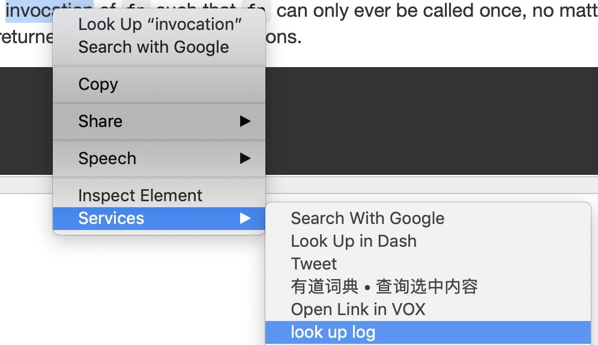
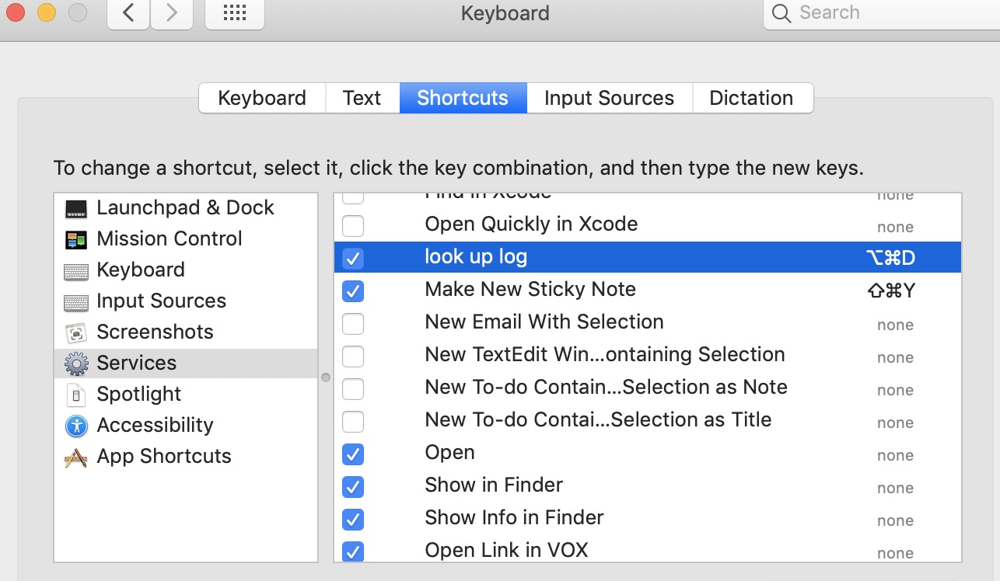

# Look Up Log Workflow

This is a look up workflow for macOS. It will record word you look up and append it to `words.txt` on your desktop.

## Usage
1. Download `look up log.workflow` then double click it to install.
2. Select the word you want to look up, then open context menu and click `look up log`.

3. Set a shortcut to this workflow in `System Preferences > Keyboard`

